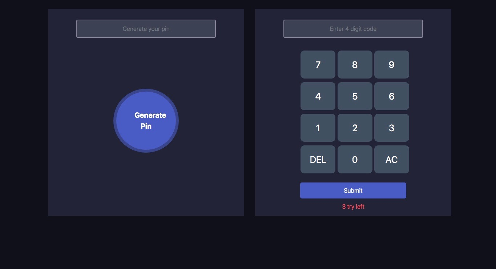

#  PIN-MATCHER-OWNtry
## Details 
This is a matching method like a machin for generating pin code.

## Technology
+  JavaScript
+  CSS
+  HTML

## How this site works
* first you have to click generate button to get a 4 digit pin code
* And than use the calculator & put the same input .
* Than click the Submit button.
  * if your number is matched it will show a correct notification.
  * if your number isn't correct than it will show a incorrect notification.
    * you get three chances to enter the pin number accurately after that button will be disabled 
* If you put nothing and click the submit button
  * than you get a alert message.

## Click below to enjoy...
[CLICK ME](https://shahinuralambhuiyan.github.io/PIN-MATCHER-OWNtry/)
## Thank you.
